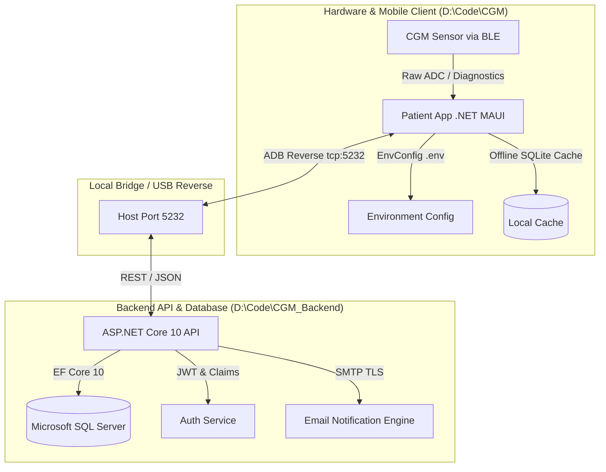

# Continuous Glucose Monitoring (CGM) Platform
## Complete Technical Review & Architecture Documentation

**Document Version:** 1.0.0  
**Project Repositories:**  
- **Frontend (Mobile Client):** [https://github.com/Faizanhassan47/CGM](https://github.com/Faizanhassan47/CGM)  
- **Backend (API & Database):** [https://github.com/Faizanhassan47/CGM-Backend-](https://github.com/Faizanhassan47/CGM-Backend-)  

---

## 1. Executive Summary & System Overview

The **CGM Platform** is an enterprise-grade, clinical-quality Continuous Glucose Monitoring software ecosystem composed of:
1. **Frontend Patient Mobile App (`Userapp`)**: Built with **.NET MAUI (C# / XAML)** targeting Android, iOS, Windows, and MacCatalyst, designed with aesthetics inspired by Dexcom G7 and Abbott FreeStyle Libre 3.
2. **Backend Web API (`CGM.Api`)**: Built with **ASP.NET Core 10** using Entity Framework Core, SQL Server, JWT authentication, and rate limiting.
3. **BLE Hardware Diagnostic Engine**: Implements Bluetooth Low Energy (BLE) scanning, pairing, and raw sensor telemetry communication with hardware CGMs.
4. **Test & Validation Suite (`CGM.PatientApp.Tests`)**: Automated unit test suite with 49 unit tests verifying parsers, converters, and device state engines.



---

## 2. Frontend Architecture & Features (`Userapp`)

### 2.1 Technology Stack & Architecture
- **Framework:** .NET MAUI 10.0 (C# 13, XAML with `MauiXamlInflator=SourceGen` compile-time inflation).
- **Architecture Pattern:** MVVM (Model-View-ViewModel) powered by CommunityToolkit.Mvvm (`[ObservableProperty]`, `[RelayCommand]`).
- **Data Visualizations:** SkiaSharp and LiveChartsCore for 60fps vector graphics.
- **Typography:** Custom loaded fonts `Manrope` (Regular, SemiBold, Bold) and `FontAwesome` (Solid, Regular, Brands).

---

### 2.2 Complete UI/UX Feature Breakdown

#### A. Authentication Experience
1. **Splash Screen (`SplashPage.xaml`)**: Checks session authentication token in secure device storage. Automatically routes authenticated users to Dashboard, or unauthenticated users to Login.
2. **Login Screen (`LoginPage.xaml`)**:
   - Secure email and password entry with visibility toggle.
   - Clinical banner alerts for connection status and validation errors.
   - "Remember Me" toggle persisted via `SecureStorage`.
3. **Registration Screen (`SignUpPage.xaml`)**: Full patient onboarding with email, full name, phone number, and password validation rules.
4. **Forgot & Reset Password Flow (`ForgotPasswordPage.xaml`, `ResetPasswordPage.xaml`)**: 6-digit verification code delivery via SMTP with expiration timers.

#### B. Sensor Setup & Bluetooth Onboarding Flow
1. **Device Selection (`DeviceSelectionPage.xaml`)**:
   - Selection cards between **Disposable CGM** (14-day wear, all-in-one sensor) and **Reusable CGM** (replaceable sensor + rechargeable transmitter).
   - Illustrated with custom high-resolution clinical renders.
2. **Bluetooth Permissions (`BluetoothPermissionPage.xaml`)**:
   - Handles Android 12+ runtime permissions (`BLUETOOTH_SCAN`, `BLUETOOTH_CONNECT`, `ACCESS_FINE_LOCATION`).
3. **Sensor Scanning (`ScanningPage.xaml`)**:
   - Visual pulse radar animation scanning for BLE advertising packets matching CGM device UUIDs.
4. **Connecting & Verification (`ConnectingPage.xaml`, `ConnectionSuccessPage.xaml`)**:
   - Performs diagnostic handshakes (E7, E8, E1, E2, E3).
   - "I'll do this later" bypass button allowing direct dashboard navigation.

#### C. Live Clinical Dashboard (`DashboardPage.xaml` & `DashboardViewModel.cs`)
1. **Hero Glucose Card**:
   - Primary glucose display (e.g. `108 mg/dL`).
   - Dynamic trend indicator: Stable (`→`), Rising Slowly (`↗`), Rising Rapidly (`↑`), Falling Slowly (`↘`), Falling Rapidly (`↓`).
   - Dynamic color styling: Green (In Target: 70–180 mg/dL), Amber (Low: 54–69 mg/dL or High: 181–250 mg/dL), Red (Urgent Low: <54 mg/dL or Urgent High: >250 mg/dL).
2. **Interactive SkiaSharp Trend Chart**:
   - 24-hour historical glucose curve with target green safe zone band (70–180 mg/dL).
   - Interval selector buttons: `3H`, `6H`, `12H`, `24H` with active state highlight.
3. **Quick Event Logging Card**:
   - One-tap logging buttons for everyday diabetes management:
     - `+ Meal` (logs carbohydrate count in grams and meal type).
     - `+ Insulin` (logs bolus/basal rapid-acting units).
     - `+ Activity` (logs workout duration and intensity).
   - Live stream of recent logged events with timestamps and badges.
4. **Interactive 7-Day Weekly Calendar Strip**:
   - Responsive horizontal strip built with `FlexLayout` distributing 7 days evenly across any screen size.
   - Displays Day abbreviation (Mon, Tue, Wed...), Date number, and a clinical TIR status dot:
     - 🟢 Green: TIR $\ge$ 70%
     - 🟡 Amber: TIR 50–69%
     - 🔴 Red: TIR < 50%
   - Tap interaction: Selecting any day updates the day's readings, recalculates statistics, and triggers haptic feedback.
5. **Emergency Hypoglycemia Guidance Card ("Rule of 15")**:
   - Prominently featured critical alert card on the Alerts tab (`#FFF1F2` soft red background, `#BE123C` clinical warning border).
   - Displays clinical protocol steps:
     1. Eat/drink 15g fast-acting carbs (juice, glucose tabs).
     2. Wait 15 minutes without eating more.
     3. Re-check glucose; repeat if still below 70 mg/dL.
   - Built-in **15-Minute Countdown Timer** with interactive Start/Stop button.
   - One-tap **"Call Emergency Caregiver"** dialer button (`Launcher.OpenAsync("tel:...")`).
6. **Haptic Feedback**:
   - Integrated `HapticFeedback.Default.Perform(HapticFeedbackType.Click)` on tab navigation, time interval filter toggles, calendar selection, and event logging.

---

### 2.3 Hardware Communication & BLE Engine

- **Service:** `AndroidBleService.cs` implementing `IBleService`.
- **Protocol Adherence**:
  - Implements diagnostic command sequences for baseline hardware verification:
    - `0xE7`: Hardware Serial Number & Firmware Query.
    - `0xE8`: Battery Voltage & Power State.
    - `0xE1`: Sensor Polarization & Warmup Status.
    - `0xE2`: Working Electrode 1 (WE1) Diagnostic Telemetry.
    - `0xE3`: Temperature Sensor Baseline.
  - **Clinical Safety Boundary**: Adheres strictly to safety protocols—raw nanoampere electrode current is never fabricated into glucose without proper factory/capillary calibration curves.

---

### 2.4 Mobile Environment Configuration (`EnvConfig`)

- **Files:** `Userapp/.env`, `Userapp/.env.example`, `Userapp/Resources/Raw/app.env`.
- **Engine:** `EnvConfig.cs` loads configuration on startup:
  1. Checks local `.env` file (desktop and test runs).
  2. Reads packaged `app.env` asset via `FileSystem.OpenAppPackageFileAsync("app.env")` on physical Android and iOS devices.
- **Configurable Parameters:**
  - `CGM_API_BASE_URL`: Base address for API (`http://127.0.0.1:5232/` for USB reverse, `http://10.0.2.2:5232/` for emulator, or PC LAN IP).
  - `CGM_USE_MOCK_SERVICES`: Toggle between live backend API and local mock development provider.
  - `CGM_USE_REAL_BLE`: Hardware BLE vs simulator.

---

## 3. Backend Architecture & API Services (`CGM.Api`)

### 3.1 Technology Stack & Architecture
- **Framework:** ASP.NET Core 10.0 (C# 13).
- **ORM:** Entity Framework Core 10 with Microsoft SQL Server provider.
- **Security:**
  - JWT Bearer Authentication (`HMAC-SHA256`).
  - Refresh token rotation with SHA-256 token hashing and revocation tracking.
  - PBKDF2 Password Hashing with 100,000 iterations using HMAC-SHA256.
  - Sliding window rate limiting (`Microsoft.AspNetCore.RateLimiting`).
  - Cross-Origin Resource Sharing (CORS) policy.
- **Documentation:** Swagger UI / OpenAPI specification exposed at `http://localhost:5232`.

---

### 3.2 Complete REST API Surface

| Area | HTTP Method | Route | Description |
| :--- | :--- | :--- | :--- |
| **Auth** | `POST` | `/api/Auth/register` | Register new user account with hashed password |
| **Auth** | `POST` | `/api/Auth/login` | Authenticate user; returns JWT and refresh token |
| **Auth** | `POST` | `/api/Auth/refresh-token` | Rotate refresh token and issue new JWT access token |
| **Auth** | `POST` | `/api/Auth/forgot-password` | Send 6-digit password reset verification code via email |
| **Auth** | `POST` | `/api/Auth/verify-reset-code`| Validate reset code before password update |
| **Auth** | `POST` | `/api/Auth/reset-password` | Set new password with valid reset token |
| **Auth** | `POST` | `/api/Auth/logout` | Revoke active refresh token |
| **Auth** | `DELETE` | `/api/Auth/account` | Soft-delete / deactivate user account |
| **Devices** | `GET` | `/api/Devices` | List registered CGM transmitters / sensors for patient |
| **Devices** | `POST` | `/api/Devices/register` | Pair and register a new CGM device |
| **Devices** | `GET` | `/api/Devices/{id}` | Get device metadata, firmware, and battery status |
| **Devices** | `PATCH` | `/api/Devices/{id}/status` | Update device operating status (Active, Paired, Expired) |
| **Sensors** | `GET` | `/api/Sensors/active` | Get currently active attached sensor wear duration |
| **Sensors** | `POST` | `/api/Sensors/start` | Initialize 14-day sensor warmup session |
| **Glucose** | `POST` | `/api/Glucose/measurement` | Stream single live glucose telemetry point |
| **Glucose** | `POST` | `/api/Glucose/sync-bulk` | Bulk sync offline historical data buffer |
| **Glucose** | `GET` | `/api/Glucose/history` | Query glucose readings within a time window |
| **Glucose** | `GET` | `/api/Glucose/summary` | Calculate Time In Range (TIR), Mean, GMI, and SD |
| **Alerts** | `GET` | `/api/Alerts` | Fetch critical/warning alerts list |
| **Alerts** | `POST` | `/api/Alerts/{id}/read` | Acknowledge alert |
| **Profile** | `GET` | `/api/Profile` | Retrieve patient preferences and target glucose range |
| **Profile** | `PUT` | `/api/Profile` | Update target ranges, units (`mg/dL` or `mmol/L`) |
| **Health** | `GET` | `/api/Health/db-check` | Verify SQL database connectivity and latency |

---

### 3.3 Database Architecture (SQL Server)

- **Entities & Tables:**
  - `Users`: Account credentials, verification flags, creation timestamps.
  - `PatientProfile`: Target glucose range (e.g. 70–180 mg/dL), units, theme, contact info.
  - `RefreshTokens`: Token hashes, expiry timestamps, device info, IP addresses, revocation status.
  - `CgmDevices`: Serial numbers, hardware models, pairing status, battery levels.
  - `Sensors`: Sensor serials, insertion timestamp, expiration date (14 days), status.
  - `GlucoseMeasurements`: Timestamp, value (mg/dL), trend arrow, raw sensor current (nA), temperature.
  - `Alerts`: Category (Urgent Low, High, Sensor Expiring), severity, read status.
- **Automatic Seed Engine (`DbInitializer.cs`)**:
  - Automatically seeds default patient account: `faizanhassan47@gmail.com` with configured clinical profiles.

---

## 4. Repository Separation & Decoupling

The monolithic codebase was split into two independent repositories to ensure clean separation of concerns:

```
D:\Code\
├── CGM\                     <-- Client Mobile App & Unit Tests
│   ├── .env.example
│   ├── .gitignore
│   ├── Userapp\             <-- .NET MAUI App
│   └── CGM.PatientApp.Tests\
│
└── CGM_Backend\             <-- Standalone Backend API & Database
    ├── .env.example
    ├── .gitignore
    ├── CGM.Backend.slnx     <-- Dedicated Solution File
    ├── README.md
    ├── CGM.Api\             <-- ASP.NET Core 10 Web API
    └── Database\            <-- SQL Scripts & Migrations
```

---

## 5. Verification, Quality Assurance & Deployment

### 5.1 Automated Unit Tests
- **Project:** `CGM.PatientApp.Tests`
- **Results:** **49 passed, 0 failed, 0 skipped** (Execution time: ~185ms).
- **Coverage Areas:**
  - `ProtocolParserTests.cs`: BLE diagnostic frame decoding (E7, E8, E1, E2, E3).
  - `GlucoseUnitConverterTests.cs`: Conversion between `mg/dL` and `mmol/L`.
  - `DeviceModelTests.cs`: Sensor expiration, battery state calculations, and status transitions.

### 5.2 Physical Android Device Testing
- **Target Hardware Tested:**
  - **Google Pixel 8** (`37221FDJH0078U` running Android 14)
  - **Samsung Galaxy** (`SM-A075F` / `R8VY7011EWY` running Android 14)
- **Live Validations Captured on Device:**
  - Clean app startup, splash screen routing, and logo rendering.
  - User authentication and JWT storage against the live backend API.
  - Full clinical Dashboard rendering with live Quick Event logging, Weekly Calendar strip, and Rule of 15 emergency card.

---

## 6. How to Run the Platform

### A. Start Backend API
```powershell
cd D:\Code\CGM_Backend
dotnet run --project CGM.Api/CGM.Api.csproj --urls "http://0.0.0.0:5232"
```
*Swagger UI is available at:* `http://localhost:5232`

### B. Deploy & Run Frontend App on Physical Android Phone
```powershell
cd D:\Code\CGM\Userapp

# 1. Reverse port 5232 so the phone connects to your local PC backend
adb reverse tcp:5232 tcp:5232

# 2. Build and deploy signed APK to device
dotnet build -f net10.0-android
adb install -r bin\Debug\net10.0-android\com.companyname.cgm.patientapp-Signed.apk

# 3. Launch App
adb shell monkey -p com.companyname.cgm.patientapp -c android.intent.category.LAUNCHER 1
```

### C. Run Frontend on Windows Desktop
```powershell
cd D:\Code\CGM\Userapp
dotnet build -t:Run -f net10.0-windows10.0.19041.0
```
